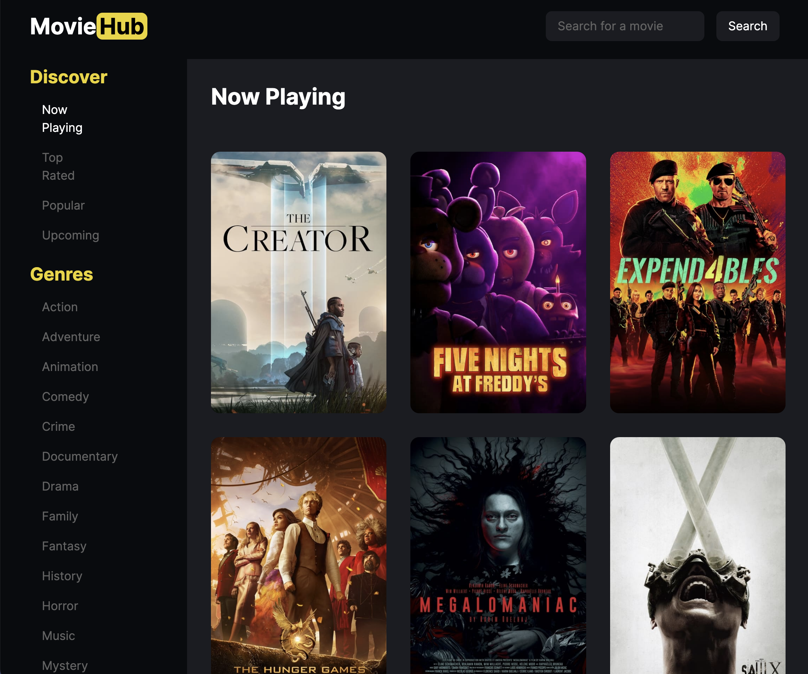

# [MovieHub 🔗](https://moviehub-io.vercel.app/discover/now_playing)

MovieHub is a responsive movie information website built with Next.js 14, styled using Tailwind CSS. It leverages the TMDB API to fetch movie genres and details, providing users with an immersive experience to explore and learn about their favorite movies.

## Technologies Used

-   **Next.js 14**: The project is built on the latest version of Next.js, a React framework that enables server-side rendering and efficient client-side navigation.
    
-   **Tailwind CSS**: Tailwind is used for styling, ensuring a responsive and visually appealing design across various screen sizes, from mobile to desktop.
    
-   **TMDB API**: The project integrates with The Movie Database (TMDB) API to dynamically fetch information about movie genres and details.
    
-   **React Router Navigation**: Next.js router is used for seamless navigation between pages. Individual movie details are displayed dynamically using Next.js router functionality.
    
-   **Pagination with React Refs**: The website incorporates smooth scrolling pagination, allowing users to navigate between pages effortlessly. React refs are used to manage and control the scrolling behavior.
    
-   **Search Functionality**: MovieHub features a search bar that utilizes the TMDB API to allow users to search for any movie in the database.
    

## Features

### 1. Genre Selection

Users can choose from various movie genres, with the website dynamically fetching and displaying movies based on the selected genre.

### 2. Movie Details

Clicking on an individual movie image reveals detailed information about the movie, including an overview, language, production date, and breadcrumbs indicating the genre of the movie. This is achieved through Next.js router navigation.

### 3. Responsive Design

Tailwind CSS ensures that the website is responsive and provides an optimal viewing experience on both mobile and desktop screens.

### 4. Pagination

The main screen incorporates smooth scrolling pagination, allowing users to navigate through multiple pages of movie listings.

### 5. Search Bar

A search bar is provided, enabling users to search for any movie in the TMDB database, enhancing the user's ability to discover specific movies.

## How to Run Locally

1.  Clone the repository:
    
    bashCopy code
    
    `git clone https://github.com/your-username/MovieHub.git` 
    
2.  Install dependencies:
    
    bashCopy code
    
    `cd MovieHub
    npm install` 
    
3.  Run the development server:
    
    bashCopy code
    
    `npm run dev` 
    
4.  Open your browser and navigate to `http://localhost:3000` to explore MovieHub.
    
  ## [Visit Live Demo](https://moviehub-io.vercel.app/discover/now_playing)

Feel free to contribute, report issues, or provide feedback!